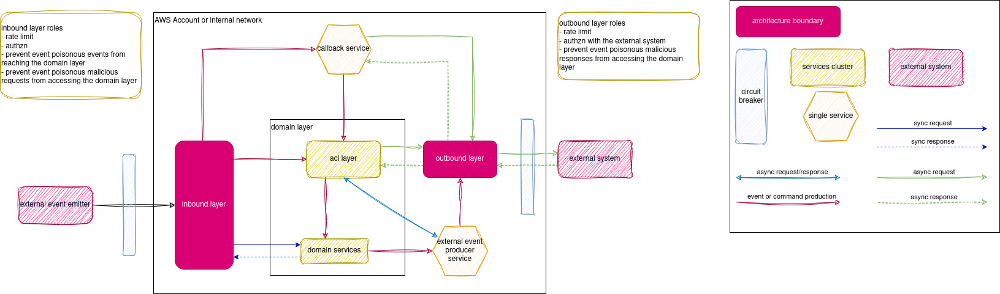
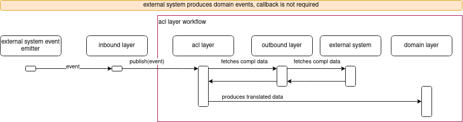
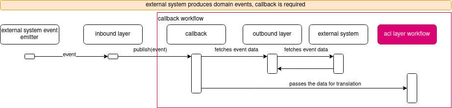
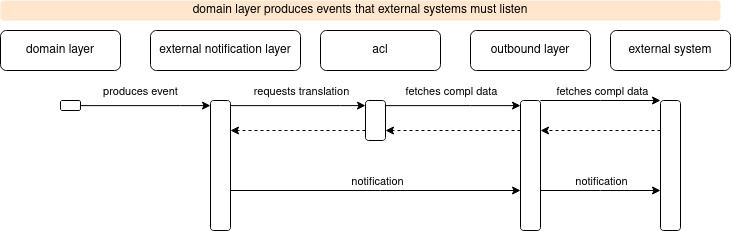

# anti-corruption-layer-external-systems-decoupling

Anti corruption layer is a concept introduced by Eric Evans in his book "Domain Driven Design".
Its an intermediate layer to translate a domain into another. This prevents concepts
from one domain from poisoning the other, as well reducing coupling between the domains

Inspired by recent events with this architecture I've decided to document our approach
for applying this concept in my team. Here is a list of problems we've been dealing with these last few months
- We have overall guidelines for integrating systems, but not a standard on how to deal with incoming or outgoing requests once those requests reach our system or our system requires requesting or sending data to other systems
- our services communicate with vendors and their concepts were leaking into our system
- by having vendor coupling, changes into their structure started affecting our services
- rate limiting for outgoing sync requests stared affecting our services that performed sync integrations with external systems and vendors
- with a high number of external APIs integrations spread accross our services, we found ourselves in a loop fixing integrations and related work

## the solution 
Based on the conpcets of inbound and outbound adapters from hexagonal architecture we've decided to reploicicate those layers, but encapsulating a cluster of related services that together prevent specific concepts from leaking into our domain layer, also a cluster of services.

Both and inbound and outbound layers can apply:
- rate limiting to control rate of requests sent to or received by external systems
- custom authzn layer

**For the inbound layer**
- either dispatches received events and write requests to ACL layer or callback service

**For the outbound layer**
- outbound sub-layer dedicated to each system or vendor, if required
- facade in case the the external system or vendor have different communication styles
- caching

**The domain layer**
- responsible only for domain objects with its own internal contracts, isolating it from the external world
- domain object events publishing
- business rules
- communicates only with the servies whtin the domain layer do apply business logic

## incoming events or write requests, no callback is requred

## incoming events or write requests, callback is requred

## Domain layer produces domain events for external systems

